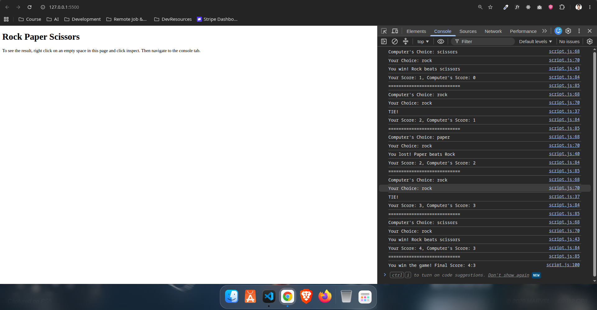

# Rock Paper Scissors — My First JavaScript Game

A simple **Rock Paper Scissors** game built with vanilla JavaScript as part of **The Odin Project Foundations** curriculum.

This was my first JavaScript project built from scratch. The game runs entirely in the browser console and allows the player to compete against a computer-generated choice for five rounds.

## Live Demo

**[Play the game](https://al-zehad.github.io/odin-rock-paper-scissors/)**

## Preview



## About the Project

The goal of this project was to practice fundamental JavaScript concepts by building a small but complete game without using a graphical user interface.

The player enters `rock`, `paper`, or `scissors` through a browser prompt. The computer randomly selects its own choice, and the game determines the winner of each round.

The game continues for **5 rounds**, keeps track of both players' scores, and displays the final result in the console.

## Features

* Computer randomly selects Rock, Paper, or Scissors
* Player enters their choice using `prompt()`
* Case-insensitive player input
* Five rounds per game
* Score tracking for both the player and computer
* Round-by-round results displayed in the console
* Final game result displayed after all five rounds
* Tie handling

## Technologies Used

* **HTML5**
* **JavaScript**
* **Browser Console**

No external libraries or frameworks are used.

## How to Play

1. Open the [live demo](https://al-zehad.github.io/odin-rock-paper-scissors/).
2. Open your browser's **Developer Tools → Console**.
3. Enter your choice when prompted:

   * `rock`
   * `paper`
   * `scissors`
4. The computer will randomly select its choice.
5. The result of the round and the current score will be displayed in the console.
6. Continue for 5 rounds.
7. The final winner and score will be displayed at the end.

### Rules

* Rock beats Scissors
* Scissors beats Paper
* Paper beats Rock
* Matching choices result in a tie

## What I Learned

This project helped me understand several important JavaScript fundamentals.

### Functions

I practiced creating functions, passing arguments, and returning values.

For example, the computer's choice is generated by the `getComputerChoice()` function, while `playRound()` handles the logic for an individual round.

### Random Number Generation

I learned how `Math.random()` can be combined with `Math.floor()` to generate a random number that can be used to select between multiple choices.

```javascript
const choiceNumber = Math.floor(Math.random() * 3);
```

### Conditional Logic

The game uses `if`, `else if`, and `else` statements to determine the result of each round based on the player's and computer's choices.

### Variables and Scope

I practiced using `const` and `let`, as well as understanding how variables can be scoped inside functions.

### Function Parameters and Return Values

The project gave me practical experience with passing data into functions and returning useful values from them.

### Loops

I used a `for` loop to run the game for five rounds:

```javascript
for (let i = 0; i < 5; i++) {
    // play a round
}
```

This also helped me understand that a function needs to be called again when I want a new result.

### User Input

I learned how to use the browser's `prompt()` method to receive input from the player.

### Template Literals

I used template literals to display dynamic information such as the current choices and scores:

```javascript
console.log(`Your Score: ${humanScore}, Computer's Score: ${computerScore}`);
```

### Game State and Score Management

One of the things I initially struggled with was understanding how the score should be updated after each round.

I eventually understood that the result of `playRound()` could be used to determine which score should be incremented. This helped me understand how a program can maintain and update its state while it runs.

## Challenges I Faced

One issue I encountered while building the game was that it wasn't asking me for a new choice before every round.

After debugging the code, I realized that I had not actually told the program to request a new human choice each time the loop ran.

The solution was to place the calls to `prompt()`, `getHumanChoice()`, and `getComputerChoice()` **inside the game loop**, so new choices would be generated for every round.

This was a useful lesson in understanding how loops and function calls work together.

## Project Structure

```text
odin-rock-paper-scissors/
├── Screenshots/
│   └── preview.png
├── index.html
└── script.js
```


## The Odin Project

This project was completed as part of **The Odin Project — Foundations** JavaScript curriculum.

The project focuses on applying fundamental programming concepts through a simple Rock Paper Scissors game.

**Project assignment:**
https://www.theodinproject.com/lessons/foundations-rock-paper-scissors

## Future Improvements

This project intentionally follows the requirements of the Foundations assignment and remains a console-based game.

A future version could introduce:

* A graphical user interface
* Buttons for Rock, Paper, and Scissors
* Displaying scores directly on the webpage
* Visual feedback for each round
* A reset/restart button

These improvements are intentionally outside the scope of this version.

## Author

**Al Zehad**

Built as part of my journey learning JavaScript and working through **The Odin Project Foundations** curriculum.
